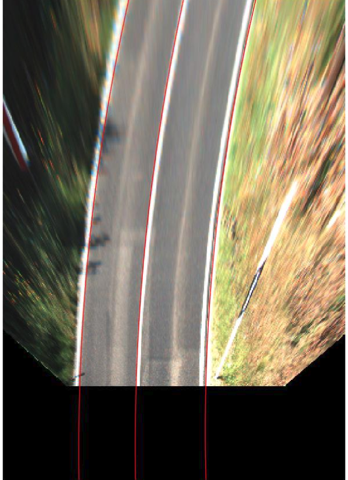

## dp_based_lane_detection
A lane detection package which is written by MATLAB

## How to use
1. set the parameters in the ```config.m```
2. run ```main.m```

## Results
1. image preprocessing results

2. lane detection result on bird eye's view image

3. lane detection result on raw image


## Reference
To use the code, pleace cite this paper:
```
@inproceedings{jiao2019using,
  title={Using DP Towards A Shortest Path Problem-Related Application},
  author={Jiao, Jianhao and Fan, Rui and Ma, Han and Liu, Ming},
  booktitle={2019 IEEE International Conference on Robotics and Automation (ICRA)},
  year={2019},
  organization={IEEE}
}
```
